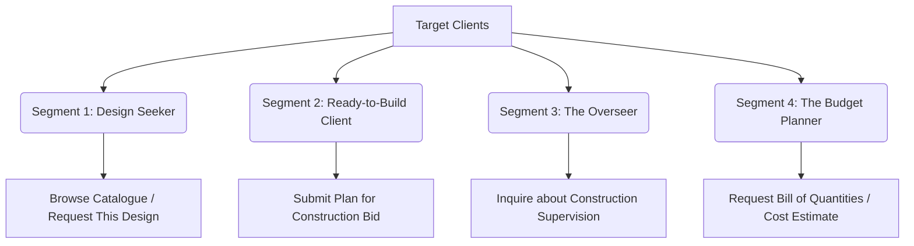

# Safe-Construct: General Overview & Objectives (Version 1)

Safe-Construct is a modern, tech-enabled construction and architectural design firm. Our mission is to bridge the gap between clients and building projects by offering transparency, quality assurance, professional architecture, and end-to-end building services.

Through our Next.js and Supabase web application, we aim to acquire new customers, showcase our architectural design portfolio (Catalogue), and capture high-intent customer leads.

---

## 1. Company Objective

Our primary objective is to de-risk the construction process for homeowners and developers. We achieve this by:

*   Providing high-quality architectural designs.
*   Delivering all-inclusive building services from excavation to finishings.
*   Offering independent, professional project supervision to ensure building quality.
*   Simplifying design intake with our conversational custom design request process.

---

## 2. Core Services

We categorize our offerings into three main pillars:

| Service Pillar | Description | Industry Terminology |
| :--- | :--- | :--- |
| **1. House Plan Architecture** | Drafting custom architectural plans, structural engineering designs, and offering a digital gallery of past plans for client inspiration. | Architectural Design & Space Planning |
| **2. Building & Construction** | End-to-end construction execution (excavation, masonry, framing, plumbing, electrical, roofing, and interior/exterior finishings). | General Contracting / Design-Build |
| **3. Construction Project Management** | Managing active sites, coordinating timelines, tracking budgets, and supplying regular progress updates. | Construction Project Management |

---

## 3. Target Clients & Solutions

Safe-Construct caters to distinct client segments. The web app is designed to convert visitors into clients via specific lead capture funnels:

### Client Segment Details

#### Segment 1: The Design Seeker (Architectural Plans)
*   **Persona**: Individuals wanting to build but who do not have an architectural plan yet.
*   **App Solution**: A beautiful, filterable Catalogue of architectural designs (by size, style, number of bedrooms, and design style origin). Visitors browse them to trigger a "Request This Design" workflow, pre-populating a custom request.

#### Segment 2: The Ready-to-Build Client (General Contracting)
*   **Persona**: Individuals who already have their architectural plans but are looking for a reliable, professional construction team to execute the build.
*   **App Solution**: A "Submit Plan for Construction Bid" flow under general contracting services.

#### Segment 3: The Overseer (Construction Supervision & Quality Assurance)
*   **Persona**: Individuals who have plans and already hired a contractor, but live far away (e.g., diaspora clients) or lack technical expertise, and need an independent third party to inspect site progress and ensure quality.
*   **App Solution**: An inquiry form under supervision services.

#### Segment 4: The Budget Planner (Cost Estimation)
*   **Persona**: Clients with plans who need to know how much the build will cost before hiring a team.
*   **App Solution**: An estimation inquiry form.

---

## 4. Key Web Application Modules (Version 1)

The first version of the Safe-Construct web application focuses on the **Public Marketing Site & Lead Acquisition**:

*   **Home Page**: Visual hero section, core value propositions, customer testimonials, and direct paths to the prospect entry points.
*   **Architectural Plan Catalogue**: Visual grid of design concepts. Filterable by style, size (sqm), room count, and design style origin. Supports interactive view/like counters, lightbox views, and image galleries with captions.
*   **Service Pages**: Detailed descriptions of House Plan Design, General Contracting, Construction Supervision, and Cost Estimation, each with tailored inquiry forms.
*   **Request Design Page**: A multi-step conversational form wizard (Project Location, Building Style, Room Layout, Special Features, Requested Documents, Additional Notes, and Meeting/Contact Details).
*   **Blog Pages**: List view and details view for company news, insights, and building advice, including commenting and tagging systems.
*   **Contact Page**: Form collecting contact info and preferred communication channels (WhatsApp/Email).
*   **About Page**: Founding story, objectives, and dynamic team member profiles.

*(Note: The secure Client Portal for tracking active project milestones, site update journals, and billing is planned for a subsequent release.)*

---

## 5. Administrator Portal Credentials (Local Development)

To access the Admin Portal (`/admin/dashboard`), log in with the following default administrator credentials:

*   **Phone Number**: `671172775` (normalised to `+237671172775`)
*   **Password**: `admin123`

---

## 6. Technology Stack & Database Foundations

*   **Framework**: Next.js (App Router, MUI + Vanilla CSS, TypeScript).
*   **Backend & DB**: Supabase (PostgreSQL database, Supabase Auth for admin login, Supabase Storage for storing catalogue images and blog media).

### Database Tables (Version 1)
*   **`profiles`**: Admin and client account mapping.
*   **`catalogues`**: Portfolio of designs.
*   **`catalogue_images`**: Captioned gallery images.
*   **`catalogue_cost_items`**: Costs breakdown per design.
*   **`request_designs`**: Conversational design request records.
*   **`service_requests`**: Inquiries for bids, estimates, and supervision.
*   **`blogs`**, **`blog_tags`**, **`blog_tag_assignments`**, **`blog_comments`**: Blogging content database.
*   **`contact_messages`**: Contact form submissions.
*   **`newsletter_subscribers`**: Newsletter emails.
*   **`team_members`**: About page team list.
