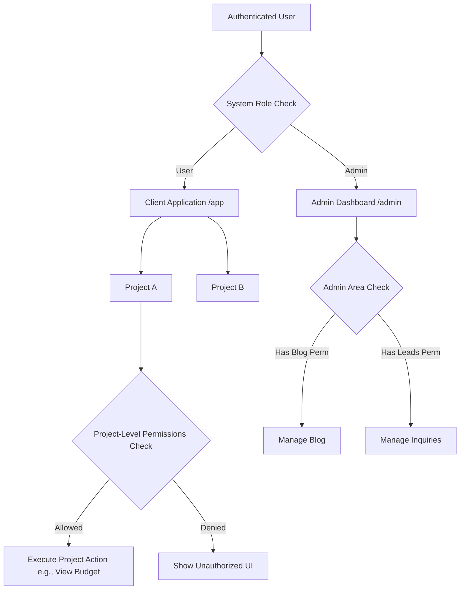

# Roles and Permissions Architecture Specification

This document details a highly scalable, flexible architecture for handling access control in the **Safe-Construct** application. Security is structured at two distinct levels: System-level (global app access) and Project-level (fine-grained project collaboration).

---

## 1. The Big Picture

Access control is divided into two separate dimensions:
1. **System Roles (Global)**: Determines whether a user enters the client-facing application (`/app`) or is authorized to enter the administrator portal (`/admin`). Admins are further restricted to specific dashboard domains (e.g., managing blogs, leads, or projects).
2. **Project Roles (Local)**: Determines what actions a user can perform inside a specific construction project they have been invited to (e.g., owner, architect, technician, treasurer). These roles serve as initial templates, but their permissions can be customized on a per-collaborator, per-project basis.



---

## 2. Level 1: System-Level Roles & Admin Permissions

At the system level, a user is globally defined as either a **User** (standard client) or an **Admin** (internal staff). 

### Global Roles
*   **User (`user`)**: Can access their client dashboard, project listings, and public-facing features. They cannot access `/admin/*` routes or administrative APIs.
*   **Admin (`admin`)**: Can access both the client-facing application (for support or viewing) and the admin dashboard.

### Admin Dashboard Granular Access (Modular Permissions)
To prevent all admins from having absolute control over everything, administrative capabilities are divided into modular permissions. For example, a marketing specialist should edit blogs but not touch project financials.

We define a set of administrative permission keys, such as:
*   `manage_blogs` (Write/Edit/Delete blogs, tags, and comments)
*   `manage_catalogues` (Manage portfolio design plans and estimates)
*   `manage_leads` (Review service requests, contact messages, and custom design inquiries)
*   `manage_projects` (Create, edit, or delete construction projects globally)
*   `manage_admins` (Grant or revoke admin access and dashboard permissions)

### System-Level Database Model
To make this scalable, we decouple the admin user from their permissions using a dedicated junction table:

1.  **Profiles**:
    *   Stores core user information (ID, email, name).
    *   Contains the `system_role` field (`admin` or `user`).
2.  **Admin Capabilities (Junction Table)**:
    *   Maps an admin user ID to specific permission keys (e.g., User A is mapped to `manage_blogs` and `manage_leads`).
    *   This makes it easy to add or remove access from the admin UI by simply adding or deleting rows in this table.

---

## 3. Level 2: Project-Level Roles & Permissions (App Collaboration)

Inside the user-facing application, collaboration revolves around individual **Projects**. A user does not have a global "Architect" or "Treasurer" status; instead, they are assigned these roles **within the context of a specific project**.

### Fine-Grained Project Capabilities
Rather than checking if a user is an "Architect" or "Treasurer" directly in the code, we define atomic **Capabilities** (permissions). Examples include:
*   `view_financials` (Read project budget, cost items, and payments)
*   `update_financials` (Log cost items, update payment structures)
*   `approve_payments` (Sign off on milestone payouts)
*   `view_blueprints` (Read architectural documents and plans)
*   `upload_blueprints` (Add or replace architectural sheets)
*   `view_site_journal` (Read progress updates, QA reports, and photos)
*   `post_site_journal` (Write progress logs, upload QA site photos)
*   `manage_collaborators` (Invite or kick other users from this project)

### Default Role Templates
When a user is invited to a project, they are assigned a role template. These templates pre-define their default capabilities:
*   **Owner**: Has all capabilities.
*   **Architect**: Defaulted to read/write blueprints and view site journals.
*   **Technician**: Defaulted to view blueprints and write site journals.
*   **Treasurer**: Defaulted to read/write financials and view site journals.

### The Scalable Customization Model (Role + Overrides)
To allow a technician to perform treasurer actions (or vice versa) on a project, we use a **Role + Override** pattern in the project membership table.

Instead of hardcoding permissions based on the role, the system checks the collaborator's actual capabilities, computed as:
> **Active Capabilities** = (Default Role Capabilities) + (Custom Granted Permissions) - (Custom Revoked Permissions)

#### Project-Level Database Model
To support this in a relational database, we use the following structure:

1.  **Projects**:
    *   Stores core project data (location, status, cost, metadata).
2.  **Project Members (Collaborators)**:
    *   Links a `user_id` to a `project_id`.
    *   Stores the `assigned_role` template identifier (e.g., `'technician'`).
    *   Stores `granted_overrides` (a list of extra capability keys manually granted to this user for this project, e.g., `['view_financials']`).
    *   Stores `revoked_overrides` (a list of capability keys revoked from this user's default role, e.g., `['post_site_journal']`).
3.  **Active Capability Resolution**:
    When the system checks if a user can upload a blueprint:
    1.  It checks if the user is the project owner.
    2.  Otherwise, it grabs the default capability list for the collaborator's assigned role.
    3.  It adds any keys in `granted_overrides`.
    4.  It filters out any keys in `revoked_overrides`.
    5.  It verifies if the target capability is in the resulting list.

This allows complete flexibility: you can grant a technician treasurer-level financial read access by simply appending `view_financials` to their `granted_overrides` list on that project.

---

## 4. Scalable Enforcement Strategy

To prevent security checks from slowing down your application, access control should be enforced at three layers using cached lookups:

### Layer A: Database Row-Level Security (Supabase RLS)
We enforce permissions directly on the database tables:
*   **Admin Dashboard Tables**: RLS checks if the user's ID exists in the admin capabilities table with the correct permission key.
*   **Project Tables**: RLS checks the `Project Members` table. A query to read blueprints will check if the user is a member of that project and if their resolved capabilities permit blueprint viewing.

### Layer B: Next.js Routing & Layouts
We use Next.js App Router layouts to guard UI pages:
*   **`/admin` layout**: Reads the user session. If they are not an admin, they are redirected. It also fetches the admin's capabilities to dynamically render sidebar links (e.g., hiding the "Blogs" tab if the admin does not have the `manage_blogs` permission).
*   **`/app/projects/[id]` layout**: Fetches the collaborator's profile and overrides for the specific project ID. It stores this context, allowing sub-pages (like budgets or blueprints) to block rendering early if the resolved capabilities are missing.

### Layer C: API / Mutation Level
Every update, delete, or creation action (handled via server endpoints or mutations) performs an authentication check first. The system retrieves the logged-in user, resolves their active project capabilities (or admin capabilities), and rejects the action before making database writes if the capability is missing.

---

## 5. Summary of Key Scalability Benefits

1.  **Auditable History**: By using overrides (`granted_overrides` / `revoked_overrides`) instead of throwing away roles, we always know a user's original role template and exactly what exceptions were made for them.
2.  **Global Default Upgrades**: If we decide to grant all *Architects* the capability to `view_financials` in the future, we simply update the default template. Every architect across all projects immediately receives this capability, except those who had it explicitly revoked in their overrides.
3.  **Clean Database Queries**: Keeping capability names simple and utilizing JSON arrays for overrides means we can check permissions in a single, index-backed database lookup.
4.  **Flexible User Interface**: Since permissions are simple strings (e.g., `view_financials`), building a permission toggling screen in the admin or project settings is as easy as rendering a list of checkboxes matching those keys.

---

## 6. Client-Side State Management (Redux vs. Server Authority)

To make the app feel instantaneous (without loading spinners every time a user clicks a button or opens a tab), using a client-side state manager like **Redux** is an excellent choice. However, we must clearly separate **UI/UX convenience** (Redux) from **real security authority** (Server/Database).

### The Security Boundary
Any state stored in the browser (Redux, React state, cookies, or LocalStorage) is completely accessible to the client. A user can open browser developer tools, modify the Redux store in memory, and manually toggle their permissions or set themselves as an administrator.

*   **Redux's Job**: Drive the User Interface. (e.g., showing or hiding tabs, enabling or disabling buttons, and rendering warning overlays). It makes the app feel fast and responsive.
*   **The Server's Job**: Enforce actual security. Every time the client makes a request to read data, update a project, or delete a blog, the server (Next.js Server Actions or Supabase RLS) must re-verify the request using a cryptographically signed session token. It never trusts the client's assertion of their permissions.

### Hydration and Persistence Lifecycle

To avoid querying the database constantly while maintaining strict security, we use a hybrid lifecycle:

```
[User Login] ──> JWT contains Global Role (Admin/User)
                    │
                    ├──> Hydrates Redux Store with System Role
                    └──> Access to `/app` or `/admin` verified at Edge (Middleware)
                            │
              [User Opens Project X] 
                            │
                            ├──> Next.js Server Layout queries Project X permissions (1 query)
                            ├──> Hydrates Project Slice in Redux Store
                            └──> Subpage Navigations check Redux in memory (0 queries)
                                 * Reads/Writes are silently verified on server via RLS
```

#### 1. At Login (Global Level)
*   **Source**: The authenticated user's JWT contains their system role (`admin` or `user`).
*   **Action**: When the user signs in, the client-side app decodes this token once and populates the **Redux System Slice**.
*   **Benefit**: This determines whether the application should render the Admin Dashboard shell or the Client App shell instantly, with zero database queries.

#### 2. Entering a Project (Project Level)
*   Instead of fetching permissions for *all* projects on login (which doesn't scale if a user belongs to dozens of projects), we load them **on demand**.
*   **Action**: When a user navigates to `/app/projects/[project_id]`, the project's root server layout queries the database once to resolve that user's active capabilities for *this specific project*.
*   **Hydration**: The server passes this capability list down to hydrate a **Redux Project Slice** for the current session.
*   **Subsequent Navigations**: As the user clicks between tabs inside the project (e.g., from *Overview* to *Blueprints* to *Budget*), Redux checks the local capability list instantly in memory. No additional database queries are made for UI rendering.

#### 3. Handling Dynamic Changes (Data Mutations)
*   If a project owner revokes a user's `view_financials` permission while they are looking at the budget tab, the local Redux state might still show the budget page.
*   However, the moment the client attempts to fetch updated financial data, the database RLS policies immediately block the read request because they check live database state. The UI will then fail to load the data, securing the system.
*   For UI sync, we can optionally listen to Supabase Realtime changes on the project members table to automatically update the client-side Redux store when permissions are edited.

