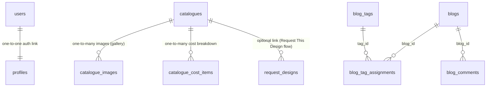

# Safe-Construct: Public Website & Lead Generation System (Version 1 Spec)

This document details the system design, database architecture, and frontend specifications for the **Safe-Construct** application. It is structured specifically as an implementation guide for the development agent (`bass44`) to generate the Next.js and Supabase codebase for the first version of the app.

---

## 1. Project Overview & Objectives

**Safe-Construct** (Version 1) is a public-facing website and lead generation platform for a tech-enabled construction and architectural design company. The objective is to establish a premium brand presence, showcase architectural design plans, and capture high-intent customer leads.

### Technology Stack
*   **Frontend**: Next.js (App Router), React, MUI (Material-UI) with custom reusable wrapper components, Vanilla CSS, `next-intl` (for English and French multilingual support).
*   **Database**: Supabase PostgreSQL.
*   **Authentication**: Supabase Auth (phone number + password). No phone OTP or email confirmation required — users gain immediate access upon registration.
*   **Storage**: Supabase Storage Buckets for portfolio media and blog images.

---

## 2. Database Schema & Relationships

The database is built with integrity constraints, performance indexes, automated triggers, and Row Level Security (RLS) policies. The schema file is located at [schema.sql](file:///Users/macitosh/Documents/Programming/nextjs/safe-consruct-nextjs-app/schema.sql).

### Entity-Relationship Diagram (Mental Model)

### Table Definitions & Purpose

1.  **`profiles`**: Stores user profiles synced from Supabase Auth (`auth.users`) via a trigger. Roles are `'admin'` or `'client'`. Includes `preferred_locale` (default `'en'`) to support client localization preferences.
2.  **`catalogues`**: The portfolio of architectural designs. Includes English fields (`title`, `description`) and French translations (`title_fr`, `description_fr`), size (sqm), bedrooms, bathrooms, style (duplex, bungalow, villa, etc.), and **design style origin** (africa, europe, america, canada) to optimize initial listings by geolocation.
3.  **`catalogue_images`**: Stored images for each catalogue item, containing an `image_url` and a descriptive `caption`.
4.  **`catalogue_cost_items`**: Customizable cost breakdown lines (e.g. Foundation, Roofing) synced to auto-calculate the total cost. Includes `label_fr` (French label translation).
5.  **`request_designs`**: Captures multi-step conversational architectural design requests (location details, land availability, structural style, room layout, document lists, scheduled meeting date, final client contact details, and the active `locale` of the submission).
6.  **`service_requests`**: Captures general service leads (architectural design, general contracting, supervision, cost estimation inquiries) along with the submission's `locale`.
7.  **`blogs`**, **`blog_tags`**, **`blog_tag_assignments`**, **`blog_comments`**: The complete blogging platform, supporting tags, views, likes, and comment moderation. Blogs include French fields (`title_fr`, `excerpt_fr`, `body_fr`). Tags include `name_fr`.
8.  **`contact_messages`**: Direct messages submitted via the contact form, including preferred communication channel (WhatsApp or Email) and submission `locale`.
9.  **`newsletter_subscribers`**: Captures newsletter signups (email lists).
10. **`team_members`**: Public profiles of administrators and team members displayed on the About page. Includes `title_fr` for French role translations.

---

## 3. Core Workflows & Mapped Frontend Views

### Workflow 1: The Design Seeker (Catalogue)
*   **User Flow**: Public user browses `/catalogue` (which defaults to showing designs matching their detected region origin) -> Filters by bedroom count, floors, size, style, or origin -> Clicks a design card -> Views gallery images with captions and estimated cost breakdown -> Clicks "Request This Design" to launch the Request form pre-filled with this design's characteristics.

### Workflow 2: Conversational Design Request (`/request-design`)
*   **User Flow**: User goes through a 7-step interactive wizard:
    1.  *Project Location*: Select country, land status, site plan availability.
    2.  *Building Style*: Select architectural style (Bungalow, Duplex, Villa, etc.) and number of floors.
    3.  *Room Layout*: Bedrooms, bathrooms, parking, garden, fence.
    4.  *Special Features*: Pool, solar power, borehole, servant quarters, total desired area.
    5.  *Requested Documents*: Blueprints, 3D renders, structural drawings, bill of quantities (BOQ).
    6.  *Additional Notes*: Text area for custom client inputs.
    7.  *Meeting & Contact*: Select meeting time, timezone, full name, phone number (WhatsApp compatible), and email.
*   **System Action**: Inserts a row into `request_designs`.

### Workflow 3: General Service Leads (`/services/[slug]`)
*   **User Flow**: Visitor visits `/services/general-contracting`, `/services/construction-supervision`, etc., and submits a specific inquiry form.
*   **System Action**: Inserts details into the `service_requests` table using the appropriate `request_type`.

### Workflow 4: Contact & Newsletter Signup
*   **User Flow**: User submits message at `/contact` or joins newsletter via footer inputs.
*   **System Action**: Inserts records into `contact_messages` or `newsletter_subscribers`.

---

## 4. Security & Access Control (Supabase RLS)

*   **Public/Guest Users**:
    *   Can view published `catalogues`, `catalogue_images`, `catalogue_cost_items`, `blogs` (and approved comments), and `team_members` (Read-only).
    *   Can submit `service_requests`, `request_designs`, `contact_messages`, `newsletter_subscribers`, and `blog_comments` (Insert-only).
*   **Clients / Authenticated Users**:
    *   Can view and edit their own `profiles` row.
*   **Admins**:
    *   Full read/write access to all tables for content management and lead follow-up.

---

## 5. Instructions for Code Generation (`bass44`)

When generating this web application, execute the steps in the following sequence:

### Step 1: Supabase DB & Storage Set Up
1.  Apply the SQL in [schema.sql](file:///Users/macitosh/Documents/Programming/nextjs/safe-consruct-nextjs-app/schema.sql) to set up tables, enums, triggers, indices, and RLS.
2.  Create Supabase storage buckets:
    *   `catalogue-media` (Public access): Gallery photos and covers.
    *   `blog-media` (Public access): Blog post feature images.

### Step 2: Next.js Boilerplate, Wrapper Components, & Multilingual Routing
1.  Establish a clean dark/light UI palette utilizing curated construction industry accents (rich slates, dark charcoal `#121824`, and construction orange `#F26419` / golden amber `#F6AE2D` for accents).
2.  **Configure Multilingual Routing**:
    *   Integrate `next-intl` to support localized sub-routes (e.g. `/en/*` and `/fr/*`).
    *   Set up middleware to detect and redirect users based on language preference (cookie or headers), defaulting to `/en`.
    *   Define English and French dictionary files (`/messages/en.json` and `/messages/fr.json`) mapping all static layout elements (navigation menus, footer links, form headers, and buttons).
3.  **Create Custom UI Wrapper Components** (to wrap and abstract MUI libraries, preventing code duplication and making future refactoring easy):
    *   `CustomDrawer`: Built on top of MUI `Drawer` for navigation drawer needs.
    *   `CustomModal`: Dialog wrapper on top of MUI `Dialog`.
    *   `CustomNotification`: Snackbar wrapper for toast messages.
    *   `CustomTooltip`: Tooltip wrapper around MUI `Tooltip` (used extensively to guide user interactions).
    *   `CustomButton` / `LoadingButton`: Buttons supporting animated states and spinner overlays.
    *   `ActionPromptButton` / `DeletePromptButton`: Confirmations prior to triggering deletions or actions.
    *   `LanguageSwitcher`: Custom header/footer dropdown widget to switch between English and French.

### Step 3: Marketing & Lead Capture Page Implementation
1.  **Home Page (`/`)**: Hero section, service highlights, teaser grid of featured catalogue items, testimonials.
2.  **About Page (`/about`)**: Story timeline, team grid loaded from `team_members` table.
3.  **Catalogue Page (`/catalogue`)**: Filter controls, geolocation-aware design card grid, dynamic cost breakdown tables, interactive views/likes counters.
4.  **Blog (`/blog`)**: Listing with tags and search, show page with rich content and approved comments thread.
5.  **Contact Page (`/contact`)**: Form with WhatsApp/Email preference, plus direct WhatsApp link CTAs.
6.  **Services Page (`/services`)**: Index showing the 4 services, plus detailed sub-pages with structured inquiry forms.
7.  **Request Design Page (`/request-design`)**: Multi-step conversational form wizard with final contact validation.
